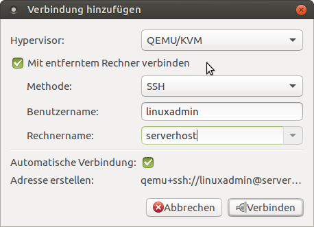

==================================================
 Einen Arbeitsplatz zur Administration einrichten
==================================================

Um KVM mit der grafischen Oberfläche "virt-manager" administrieren zu
können, kann man auf dem Virtualisierungshost einen X-Server laufen
lassen und dann vor Ort dem Host-PC arbeiten.  Aus Sicherheitsgründen
macht man das normalerweise nicht und installiert das Programm auf
einem separaten PC. Über eine ssh-Verbindung wird dann der Host-PC
gesteuert.

Virt-manager installieren
=========================

Installieren Sie mit Administratorrechten (hier hat der Benutzer
"user" sudo-Rechte) die Programme ``virt-manager`` und
``ssh-askpass-gnome`` auf einem Arbeitsplatz (hier: ``admin-pc``):

.. code-block:: console

   user@admin-pc~$ sudo apt install virt-manager ssh-askpass-gnome

Remoteverbindung herstellen
===========================
   
Stellen Sie fest, ob Sie sich mit dem Benutzer vom Administrations-PC
aus auf dem Host-PC einloggen können und kopieren Sie sinnvollerweise
einen Public-Key (hier: ``.ssh/id_ecdsa.pub``) dorthin:

.. code-block:: console

   user@admin-pc~$ ssh serverhost -l linuxadmin
   linuxadmin@serverhost's password:xxxxx
   Welcome to Ubuntu 16.04.1 LTS (GNU/Linux 4.4.0-31-generic x86_64)
   ...
   Last login: Tue Jul 19 10:45:28 2016 from 10.16.1.20
   linuxadmin@serverhost~$ logout
   user@admin-pc~$ ssh-copy-id -i .ssh/id_ecdsa.pub linuxadmin@serverhost:
   linuxadmin@serverhost's password:
   
   Number of key(s) added: 1
   
   Now try logging into the machine, with:   "ssh 'linuxadmin@serverhost'"
   and check to make sure that only the key(s) you wanted were added.
   user@admin-pc~$ ssh serverhost -l linuxadmin
   Welcome to Ubuntu 16.04.1 LTS (GNU/Linux 4.4.0-31-generic x86_64)
   ...
   Last login: Tue Jul 19 10:45:28 2016 from 10.16.1.20
   linuxadmin@serverhost~$
		
Virt-manager starten
====================

Starten Sie virt-manager. Im Menü unter Datei -> Verbindung hinzufügen
füllen Sie das Dialogfenster aus

   Hinzufügen des Serverhosts
	    
   * Anwählen von "Mit entferntem Rechner verbinden",
   * Benutzername: ``linuxadmin``,
   * Rechnername: ``serverhost``,
   * Anwählen von "Automatische Verbindung"    

und klicken auf "Verbinden". 

Linuxmuster.net installieren
============================

Um linuxmuster.net zu installieren, benötigen Sie mindestens zwei
virtuelle Maschinen: eine für die Firewall IPFire und eine für den
Server.

Zwei Alternativen: Neuinstallation von Grund auf und Import der
virtuellen Maschinen.
